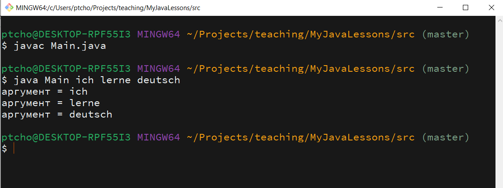

# Что же это такое - **public static void main(String[] args)**

Давайте попробуем приподнять завесу тайны с метода, который мы писали чаще всего. Надо всё-таки понимать хоть немного, то что мы пишем.

Мы уже знаем, что такое main - точка входа в нашу программу.
Мы знаем что такое void - это просто метод который выполняет код.
Пришло время понять, что мы знаем, что String[] args это просто переменная args, которая является строковым массивом.

Давайте попробуем программировать без IDE по олдскульному.

Создадим файл obj.obj.StartUno.java

```Java
public class obj.obj.StartUno {
	public static void main(String[] args) {
		for (String str : args) {
			System.out.println("My arguments = " + str);
		}
	}
}
```

Надеюсь мы ещё помним цикл фор ич, с помощью которого я хочу распечатать массив args.

Выйдем в консоль или терминал:

Скомпилируем файл:

```Java
javac obj.obj.StartUno.java
```

и запустим:

```Java
java obj.obj.StartUno ich lerne deutsch
```

на экране мы получим:

```Java
My arguments = ich
My arguments = lerne
My arguments = deutsch
```



Теперь мы должны в принципе осознавать, что String[] это массив, args имя переменной массива. И что при запуске мы можем передать эти аргументы и в теле метода обработать.

Ещё раз. Наш метод принимает массив и выводит его на экран. При запуске программы в терминале мы передаём эти аргументы. Точно так же мы могли не вывести их на экран, а в зависимости от проверки выполнить команды. Например при передачах кодового слова кофе -> запустить метод готовки кофе.

## Домашнее задание

Напишите программу, которая запускает метод готовки кофе, если переданный аргумент в командной строке "coffee" или "c".
