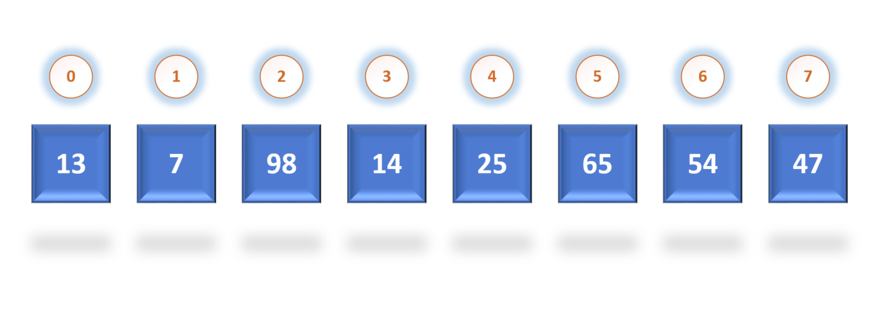

# Рекурсивные методы в Java- введение в Java 014

Многие из нас пытались сфотографировать себя в зеркале так, что бы в зеркале было снова изображение фотографирующего в зеркале и так до бесконечности. Это и есть частный случай рекурсии. В программировании это - метод, вызывающий(повторяющий сам себя) сам себя.

## Рекурсия в программировании

```Java
// Вычисление факториала числа
public class Factorial{
	public static void main(String[] args) {
		System.out.println(fact(5));
	}
	static int fact(int digits) {
		if (digits > 1) {
			return digits * fact(digits - 1); // здесь переменная умножается на метод
		} else {
			return 1;
		}
	}
}
```

Ещё раз:

```Java
{
	if (digits <= 1) // Базовый случай
	{
		return 1;
		} else {
		return digits * fact(digits - 1);
		// рекурсивный вызов с аргументом, который стремится к базовму случаю.
	}
```

**Рекурсия в программировании** – это вызов функцией самой себя с другими аргументами. Во избежании бесконечного цикла самовызывания внутри функции должно быть условие выхода **(digits <= 1)**. Рекурсивная функция вызывает себя с аргументами, которые стремятся к базовуму случаю **(digits - 1)**.

## Сортировка


*Неотсортированный массив*

Представьте себе ситуацию, что вы просите свой компьютер отсортировать фотографии по размеру или занимаемому месту, товары на странице магазина по цене и новости на сайте по дате написания.

Все эти данные, массивы информации сортируются. Сейчас мы попробуем написать простейший алгоритм сортировки массива состоящего из чисел.

### Пузырьковая сортировка - Bubble sort


```Java
import java.util.Arrays;

public class BubbleSort {
	static void bubbleSort(int[] arrUnsort) {
		int count = 0;
		for (int i = 0; i < arrUnsort.length - 1; i++)
			if (arrUnsort[i] > arrUnsort[i + 1]) {
				int temp = arrUnsort[i];
				arrUnsort[i] = arrUnsort[i + 1];
				arrUnsort[i + 1] = temp;
				count++;
			}
		}
		if (count > 0) {
			bubbleSort(arrUnsort);
	}

	public static void main(String[] args) {
		int[] myArr = {104, 64, 34, 25, 12, 22, 11, 90};
		bubbleSort(myArr);
		System.out.println(Arrays.toString(myArr));
	}
}
```

Давайте посмотрим как можно в танце объяснить пузырьковую сортировку
https://www.youtube.com/watch?v=lyZQPjUT5B4

Добавить пока нечего. Это можно закрепить только примерами. И указанием на то, что типов сортировок очень много и их можно и нужно изучать.

## Дополнительные материалы

1. https://ru.wikipedia.org/wiki/%D0%A0%D0%B5%D0%BA%D1%83%D1%80%D1%81%D0%B8%D1%8F
2. https://ru.wikipedia.org/wiki/%D0%A4%D0%B8%D0%B1%D0%BE%D0%BD%D0%B0%D1%87%D1%87%D0%B8
2. https://habr.com/ru/post/275813/ эта ссылка и домашнее задание по рекурсиям
3. https://habr.com/ru/post/337030/
4. Просто для ознакомления https://medium.com/nuances-of-programming/%D1%80%D0%B5%D0%BA%D1%83%D1%80%D1%81%D0%B8%D0%B2%D0%BD%D0%BE%D0%B5-%D0%BF%D1%80%D0%BE%D0%B3%D1%80%D0%B0%D0%BC%D0%BC%D0%B8%D1%80%D0%BE%D0%B2%D0%B0%D0%BD%D0%B8%D0%B5-74c03b764d38
5. https://www.baeldung.com/java-recursion

## Домашнее задание

Только одна домашняя задача по рекурсии

+ Написать рекурсию для нахождения чисел Фибоначи.

## Маленький анекдот

В ресторане в меню есть “Коктейль рекурсивный“. Его состав: 10% спирта, 30% воды и 60% коктейля рекурсивного. Теперь вопрос. Какова крепость коктейля?

### Решение

Но раз уж дал анекдот, то давайте и решим:

Предположим, что крепость коктейля – X (от 0 до 1). С одной стороны, крепость 1 литра коктейля равна X, т.е. в нем 1000*X мл спирта. С другой стороны, в 1 литре коктейля спирт получается собственно из спирта 100 мл и 600 мл самого коктейля.

Таким образом, получаем уравнение 1000X = 100 + 600X, решением которого является X = 25%.
