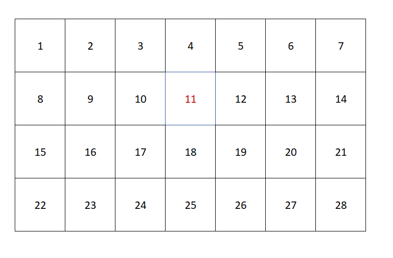

# Многомерные массивы в Java - введение в Java 015



```java
static void month() {
        int[][] monthCalendar;
        monthCalendar = new int[4][7];

        for (int outer = 0; outer < monthCalendar.length; outer++) {
            for (int inner = 0; inner < monthCalendar[outer].length; inner++) {
                monthCalendar[outer][inner] = outer*7 + inner + 1;
                System.out.println(monthCalendar[outer][inner]);
            }
        }
        System.out.println("Plz Computer, print me element [1][3], I expect 11: " + monthCalendar[1][3]);
    }
```

Я создал массив с четырьмя строчками и семью столбиками. Создал два фор цикла для инициализации массива. Во внешнем цикле я обхожу столбики, во внутреннем цикле я обхожу строчки. В программировании отсчёт начинается с нуля, а не с единицы и формула инициализации дней февраля равна __порядковый номер строчки умноженный на семь плюс порядковый номер столбика__.

Можно создать трёхмерный и четырёхмерный массив. Если будете играться, то имейте в виду, что с увеличением многомерности вы увеличивайте потребляемые мощности. Для ознакомления с **основами** программирования достаточно двухмерного массива(уверенного использования) и понятия, что массив может состоять из массивов. И массивы могут быть разными, как и длина строчек и столбцов. По этому есть такое понятие как длина массива и **длина измерения массива**.


Двумерный массив - это массив одномерных массивов. Если вам нужен двумерный массив, то используйте пару квадратных скобок:

```java
String[][] myArray = new String[5][3];

myArray[0][0] = "1";
myArray[0][1] = "Матвеев";
myArray[0][2] = "№01978434";

myArray[1][0] = "2";
myArray[1][1] = "Васечкин";
myArray[1][2] = "№21321434";

myArray[2][0] = "3";
myArray[2][1] = "Сидоров";
myArray[2][2] = "№412345678";

myArray[3][0] = "4";
myArray[3][1] = "Петечкин";
myArray[3][2] = "№587654321";

myArray[3][0] = "4";
myArray[3][1] = "Герасимов";
myArray[3][2] = "№79898321";
```


|ID ученика| Фамилия ученика | Номер паспорта|
|:----|:----:|----:|
|1|Матвеев|№01978434|
|2|Васечкин|№21321434|
|3|Сидоров|№412345678|
|4|Петечкин|№587654321|
|5|Герасимов|№79898321|

Трёхмерный массив фиксированной длины:

```java
int[][][] a1 = new int[10][20][30];
```

## Многомерные и несимметричные массивы

```java
byte[][][] byteArray = {
        {
                {0, 1, 2},
                {1, 2, 3},
                {3, 4, 5}
        },
        {
                {1, 2, 3},
                {2, 3, 4},
                {5, 6, 7}
        }
};
```


```Java
int[][] a1 = new int[5][];// двумерный массив с 5 строками
a1[0] = new int [1];
a1[1] = new int [2];
a1[2] = new int [3];
a1[3] = new int [4];
a1[4] = new int [5];

for (int[] array : a1) {
    for (int element : array) {
        System.out.print(element + " ");
    }
    System.out.println();
}

0
0 0
0 0 0
0 0 0 0
0 0 0 0 0
```

```Java
int[][] example = {
        {1},
        {2, 2},
        {3, 3, 3},
        {4, 4, 4, 4},
        {5, 5, 5, 5, 5}
};
```

Класс [java.util.Arrays](https://docs.oracle.com/javase/8/docs/api/java/util/Arrays.html) содержит методы для работы с массивами.

- **copyOf()** − предназначен для копирования массива
- **copyOfRange()** − копирует часть массива
- **toString()** − позволяет получить все элементы в виде одной строки
- **fill()** − заполняет массив переданным значением (удобно использовать, если нам необходимо значение по умолчанию для массива)
- **equals()** − проверяет на идентичность массивы
- **deepEquals()** − проверяет на идентичность массивы массивов

```Java
int arr[] = {2, 2, 1, 8, 3, 2, 2, 4, 2};
// To fill complete array with a particular value 
Arrays.fill(arr, 10);
System.out.println("Array completely filled with 10\n" + Arrays.toString(arr));
System.out.printf("Modified arr[] : %s", Arrays.toString(arr));
```

## Домашнее задание

1. Создать таблицу умножения(Пифагора) для младших классов при помощи двумерного массива.
       
2. Создайте массив размерностью 5 на 6 и заполните его случайными числами (в диапазоне от 0 до 99 ).  Выведите на консоль третью строку
3. Просуммируйте все элементы двумерного массива.
4. Дан двумерный массив, содержащий отрицательные и положительные числа. Выведете на экран номера тех ячеек массива, которые содержат отрицательные числа.
5. Отсортируйте элементы в строках двумерного массива по возрастанию
6. Даны матрицы С и D размерностью 3 на 3 и заполненные случайными числами в диапазоне  от 0 до 99. 
    - Выполните по отдельности сначала сложение, потом умножения матриц друг на друга. Выведете исходные матрицы и результат вычислений на консоль.

## Дополнительные материалы

1. https://www.baeldung.com/java-jagged-arrays
2. https://www.baeldung.com/java-multi-dimensional-arraylist
3. https://ru.wikipedia.org/wiki/%D0%90%D0%BB%D0%B3%D0%BE%D1%80%D0%B8%D1%82%D0%BC_%D1%81%D0%BE%D1%80%D1%82%D0%B8%D1%80%D0%BE%D0%B2%D0%BA%D0%B8
4. https://ru.wikipedia.org/wiki/%D0%A1%D0%BE%D1%80%D1%82%D0%B8%D1%80%D0%BE%D0%B2%D0%BA%D0%B0_%D0%BF%D1%83%D0%B7%D1%8B%D1%80%D1%8C%D0%BA%D0%BE%D0%BC
5. https://en.wikipedia.org/wiki/Cocktail_shaker_sort
6. https://ru.wikipedia.org/wiki/%D0%91%D1%8B%D1%81%D1%82%D1%80%D0%B0%D1%8F_%D1%81%D0%BE%D1%80%D1%82%D0%B8%D1%80%D0%BE%D0%B2%D0%BA%D0%B0
7. https://ru.wikipedia.org/wiki/%D0%91%D0%BB%D0%BE%D1%87%D0%BD%D0%B0%D1%8F_%D1%81%D0%BE%D1%80%D1%82%D0%B8%D1%80%D0%BE%D0%B2%D0%BA%D0%B0
8. Это особенно важный материал, с ним надо ознакомиться сейчас. Что бы когда мы его будем изучать все термины уже были в подкорке. Очень важно. https://ru.wikipedia.org/wiki/%D0%94%D0%B2%D0%BE%D0%B8%D1%87%D0%BD%D0%BE%D0%B5_%D0%B4%D0%B5%D1%80%D0%B5%D0%B2%D0%BE_%D0%BF%D0%BE%D0%B8%D1%81%D0%BA%D0%B0
9. https://javarush.ru/groups/posts/mnogomernye-massivy

