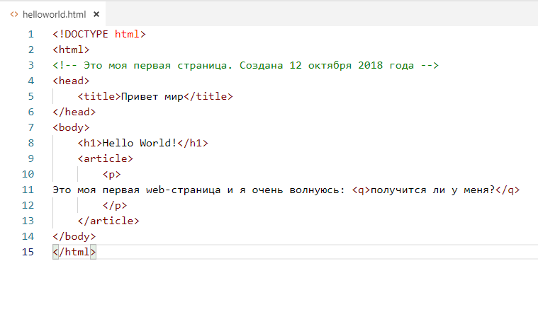
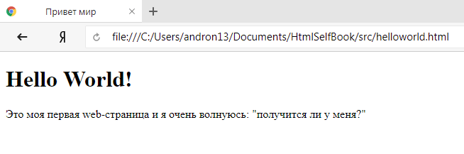
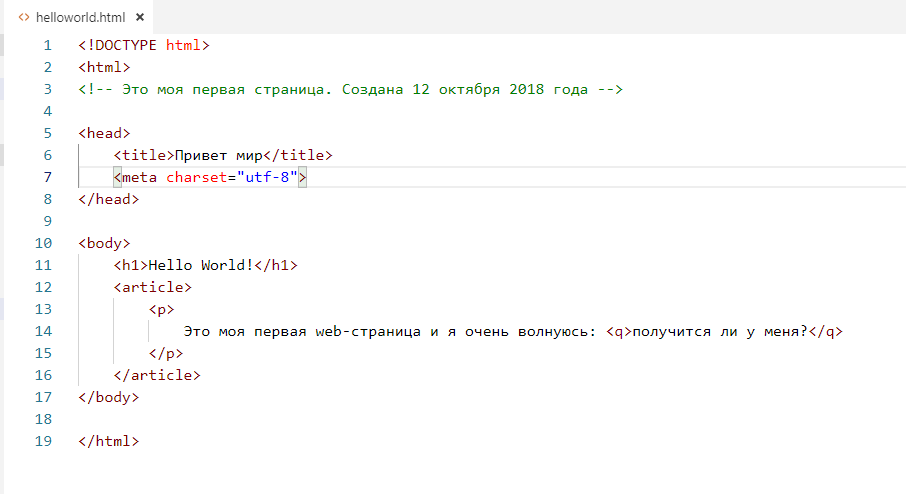

# Веб-девелопмент — пособие для начинающих

## Предисловие

Свой первый сайт я сделал ещё в 96-м году. Просто скопировав исходники с сайта модного компьютерного журнала и поставив их на свой. Принципиально это не самый плохой способ. Подсмотреть и сделать лучше. Что бы понять как это работает — просмотр чужих примеров просто обязателен.  

Последние пару лет слово _пример_ практически не используется в моём IT-круге. Принято говорить кейсы, кейс клиентa, пользовательский кейс. И это важная черта компьютерных разговоров. Очень много англицизмов. Невозможно перевести всю документацию на языки пользователей. Английский как язык технического документооборота принят на многих фирмах, где англичан к примеру никогда и не было, да и команда разработки к примеру - русская. В одной из таких фирм меня шеф бил по рукам за комментарии в коде на русском языке.  

Это я к тому, что если вы не выучите английский, то шансов стать хорошим разработчиком у вас нет. И мы подошли к главному - для кого это пособие. Сейчас, когда написана только первая глава, я вижу, что книга должна помочь взрослому человеку разобраться в мире веб-технологий. То есть это пособие для меня в прошлом, когда я не знал с чего начинать учить Frontend.

Вполне возможно, что оно поможет и редакторам сайтов, которые не собираются углублятся в веб-строительство, а просто хотят хорошо делать свою работу. Как минимум для вас, моих коллег-редакторов я и сделал обзор тегов HTML и их возможностей. Один раз ознакомиться с этим списком важно для любого человека, который пишет в этом вашем интернете.

Надеюсь это пособие поможет и тебе.

## HTML и 2019 год

Официально интернет пришёл в разные страны по разному.

| Домен | Назначение | Дата появления |
|----|:----|----:|
|COM|Коммерческие для всех|1 января 1985|
|US|США|15 февраля 1985|
|DE|ФРГ|5 ноября 1986|
|SU|Советские Союз|19 сентября 1990 |
|UA|Украина|1 декабря 1992|
|RU|Россия|7 апреля 1994|
|BY|Республика Беларусь|10 мая 1994|

В 95-м году интернет на территории бывшего СССР стоил больших денег и был скорее доступен сотрудникам научно-технических организаций и студентам высших учебных заведений. В это же время в странах западной Европы и США были уже частные интернет провайдеры, которые предлагали доступ для частных лиц из дома. В Германии на тот момент час "звонка" с модема на модем внутри города стоил около 5 немецких марок(2,5€).

Как мы видим интернет тогда был и на Западе уделом богатых или умных, или умных и богатых. Так он и развивался, медленно, лишь постепенно становясь доступным массовому пользователю и бизнесу. Развиваясь, в нём появлялись деньги, исполнители, знания, новые требования, новые возможности. И он менялся; прокладывались новые линии, придумывались новые языки, библиотеки, методы решения проблем и ... снижался порог входа.

То, что мы сегодня называем интернетом очень и очень отличается от того, что называли интернетом в 1994 году.

- HTML5 - сегодняшний стандарт интернета - принят в 2014 году.
- CSS3 - существует с 2000 года.
- React, который используется сейчас чуть ли не на 80% новых сайтов вообще придуман в 2014 году.

Технологии действительно новы и вместе с вами их учат и "бывалые" программисты. Так что это примерно как с правилами дорожного движения. У старых водителей есть опыт, у новых водителей знания. И где-то за два года работы каждый новенький становится стареньким.

### Это всё просто

Нет, серьёзно! Это всё несложно. До определённой степени. Ну так же несложно как писать красивые письма, делать презентации или отсылать письма.

HTML (Hypertext Markup Language) - не язык программирования, a язык разметки. С помощью него нельзя вычислить траекторию полёта, предсказать погоду на завтра или смоделировать поведение человека. Это просто правила отображения текста на экране.

Что мы должны понять и запомнить - с помощью HTML мы указываем параметры текста, что является заголовком, что чужой цитатой, что считать аббревиатурой, а что статьёй. Указателей для текста или правил много, больше сотни. Но все их можно выучить за неделю. С учителем. Без учителя до месяца. Даже мне понадобился всего месяц, что бы с нуля пройти весь HTML5. А мне уже за 40, плохое зрение, одышка и желание учиться новому так себе, на самом деле. Я к чему - это действительно несложно. Это HTML.

Существует множество способов разметки текста. Ваш простой ворд-файл тоже сохраняется в одной из таких разметок. В этом пособии я коснусь HTML, XML, Markdown. Первых два - общепринятые способы хранения "компьютерных данных". Markdown — один из самых популярных, на данный момент, способов написания докуменатации. Помимо HTML мы коснёмся достаточно подробно CSS и совсем немного JavaScript, чисто что бы понять, что это такое.

Давайте начнём!

## Редактор HTML

При обучении любой компьютерной технологии первым уроком учат писать Hello World!

Я не могу бросить вызов сложившийся культуре, но первым делом нам придётся выбрать инструменты где мы будет это писать.

|Название эдитора | Ссылка на сайт |Короткое примечание|
|:----|:----|:----|
|Atom|<https://atom.io/>|Oчень приятный и достаточно популярный эдитор от платформы [Github](https://github.com/) (это слово надо знать - Github)|
|Sublime Text|<https://www.sublimetext.com/>|Очень популярный редактор у маководов.|
|Visual Studio Code|<https://code.visualstudio.com/>|Очень, очень годный продукт от Microsoft. В нём я пишу это пособие|
|WebStorm|<https://www.jetbrains.com/webstorm/>|Раньше был бесплатен. На данный момент для студентов есть возможность бесплатного использования. Практически обязателен к установке. Jetbrains продукты внешне очень похожи между собой. У меня он установлен, как и все выше перечисленные редакторы.|
|Notepad++|<https://notepad-plus-plus.org/>|Любимый редактор моей жены. Сам, я лично не использую этот реактор, потому что он мне напоминает встроенный windows-редактор. Но должен сказать, что Notepad++ очень популярен среди разработчиков. И очень неплох.|

Вы можете устасновить все эти редакторы и перепробовать их по очереди. Работать с ними одновременно или разделить их по языкам. Например я использую "Visual Studio Code" для написания документации к софту и в нём у меня очень много плагинов, в Webstorm пишу уже непосредственно сайты, а Sublime у меня без плагинов, очень лёгкая и его я запускаю часто вторым редактором. Выберете свой редактор из списка или спросите друзей. Кстати очень неплохой совет. Редакторы в 2019 году достаточно сложны. И настроить для повседневной работы получится далеко не сразу. Лишний совет никогда не помешает. Спросите, чем пользуются ваши друзья.

## Рабочая папка и домашняя директория

Во-первых давайте создадим папку в которой вы будете работать. Например в домашней директории папку "HtmlLessons". И уже здесь у вас могло возникнуть два вопроса: что такое домашняя директория и почему не "html-lessons".

Домашняя директория под виндовсом обычно c:/users/"имя пользователя" и в компьютерной терминологии обозначается просто значком тилда — "~", потому что в терминале в неё попасть можно через тилду. Под Линуксом разумеется можно попасть через тилду. Под Виндовсом тилда вызывает домашнюю директорию только в линуксоподобном теминале, например Bash. Который вам тоже придётся рано или поздно поставить, потому что иначе вы не научитесь работать с Git(вы же запомнили слово GitHub вверху?).

Без упоминания слов Linux, Bash, Git стать программистом сложно. По этому лучший совет от меня - выписсывать все оставшиеся непонятными слова и искать их в поиске. Языки програмирования мало чем отличаются от обычных иностранных языков. Кому то они даются легко, а кому то сложно. Если вы из второй категории, то сжимаем зубы и зубрим.

## Git

|Термин |Ссылка |Пояснение |
|:----|:----|:----|
|Git|<https://git-scm.com/downloads>|Git - это очень популярная технология контроля версий, используемая при разработке програмного обеспечения и веб-приложений. [Онлайн инструкция на русском языке](https://git-scm.com/book/ru/v2/)|
|Github|<https://github.com/>| Популярный сервис для хранения Git-репозиториев. С 2018 года принадлежит Microsoft|
|Bitbucket|<https://bitbucket.org/>| Популярный сервис для хранения Git-репозиториев. Принадлежит Atlassian и очень тесно интегрирован с популярными IT-приложениями этой формы как Trello или Jira|
|Gitlab|<https://gitlab.com/>| Альтернативный сервис для хранения Git-репозиториев.|

Вам не надо скачивать и ставить всё это сразу. Но когда первый страх пройдёт, когда вы начнёте разбираться с HTML - вернитесь и попробуйте разобраться с GIT. Мне на это понадобилось несколько попыток. Примерно с пятой я начал разбираться и не вздрагивать при слове Git.

Я не мог не сказать про тилду, линукс, bash-терминал и Git. Уже более чем в половине видеоуроков для начинающих люди показывают всё с маков или линуксов и активно используют "~" не объясняя что это. Это очень важное сокращение, которое я тоже активно буду использовать. Потому что для меня WEB - это мир иксов.

Очень краткая методичка по работе с [Git](../02-Tools/resourcen/short_instructions/Github-basic.md "Методичка по работе с GIt").

## Кебаб из верблюдов и змей

Второй вопрос, который у вас должен был возникнуть почему папка названа большими и два слова не разделены минусом. Вопрос очень хороший. Спасибо Андрей, что задал его. Отвечать будет тоже Андрей.

Линукс различает написание строчных и прописных букв(маленькие и большие), а виндовс нет. И как бы вы не назвали файл или папку, вы должны помнить, что если вы будете хранить бекап на своём компьютере, то "одинаковые" файлы могут привести к проблемам. В HTML в принципе стараются писать всё маленькими буквами(строчными) и соединять слова через тире. Для домашнего компьютера я больше предпочитаю "CamelCaseNotation", когда всё пишется маленькими буквами, без тире, но начальные буквы каждого слова пишут с большой буквы, так принято например в языке программирования Java. Другой вариант написания через "-" называется kebab-case или lisp-case. Всё понятно? Но вы зря расслабились, это ещё не конец. У нас есть Snake case. Это змейка "foo_bar". Но и это было бы слишком просто. Есть upper_snake_case и lower_snake_case. Запутались? Давайте табличку сделаем.

|Название термина | Пример |Ссылка на википедию|
|:----|:----:|:----|
|CamelCase|HelloWorld.java|Расспространённая система обозначения переменных и файлов в Java|
|snake_case|регистр_длинный_как_змея|Расспространённая система обозначения переменных в Perl, Python, PHP, Ruby|
|kebab-case|шашлычный-регистр|Язык Lisp использует такой регистр. Или Gatsby.js|

Система, которой вы будете пользоваться не имеет большого значения, это скорее зависит от того на какой машине вы работаете и с какими технологиями. Самое главное, что бы вы были последовательными. Иногда это вообще не ваш вопрос, а политика фирмы. Спросите шефа как работает ваша фирма и следуйте указаниям. Порой это требования клиента. И от проекта к проекту настройки могут отличаться.

Возвращаясь к эдиторам. Иногда на фирме есть стандарт, который нельзя нарушать или технически не очень удобно использовать другой.

Таких религиозных вопросов в работе будет немало. Обычно для каждого языка есть конвенции(Convention). Конвенция - это свод правил, которые программисты выбрали для данного стэка(технология). Запрос "CSS Naming Conventions" выдаёт правила написания кода для CSS, которым вы будете следовать, если дойдёте до главы "CSS - это вооооообще лёхка!"

Теперь мы попробуем приветствовать мир

### Привет-мир

1. Создаём рабочую папку
2. В папке создаём файл "first-page.html"
    - Если у вас проблемы с созданием файла с расширением html, то вам нужны курсы по компьютерной грамотности и с интернетом пока стоит повременить.
    - Вы можете, конечно, попробовать создать этот файл с помощью запроса в google "как создать html файл".
    - Рекомендую параллельно к этому пособию вообще нагугливать термины и объяснения из альтернативных источников. А вдруг я не прав, а вдруг всё уже поменялось?
3. Открываем в редакторе вашего выбора наш файл.
4. И пишем в нём ручками код.  Что бы привести код в порядок и красиво его отформатировать - мы можем спросить у google как - "How do you format code in Visual Studio Code". На первом месте (скорее всего) у вас будет сайт stackoverflow.com. Этот сайт помог не одному программисту в тяжёлой ситуации. Не стесняйтесь им пользоваться. Просто иногда задавайтесь вопросом: "Кто вы без этого сайта и сможете ли вы без него повторить то, что узнали?"

Сохраняем наш файл и открываем с помощью браузера. Если всё пошло так, то мы в Chromo-подобном браузере мы увидим:



А в интернет эксплорере скорее всего:


И мы сразу же можем начинать ругать IE потому что он неправильно отображает страницы. Ну или дядю Андрея, потому что он специально не дал ещё одну строчку.

```HTML
    <meta charset="utf-8">
```

Мы добавляем её так, что бы она оказалась седьмой. Вот так:



Сохраняемся и проверяем в Интернет Эксплорере наш файл заново:


### Так что же мы написали

Давайте начнём с конца. `<meta charset="utf-8">` это то, что должно стоять в вашем HTML коде всегда. Это указание браузеру, что на странице используется не только английская кодировка. Существует множество разных кодировок кроме utf-8. Пока можете не углублять свои познания и просто пишите это строчку всегда.

То что IE-7 в итоге отобразил нашу страшненькую страницу, не значит, что мы его простили. Я держу его только для того, что бы посмотреть время от времени какой oн ужасный. Раз мы уже коснулись браузеров - вам придётся поставить маленький зоопарк: Chrome, Firefox, Safari, Opera. Хотя с большего и хром, и опера, и фаерфокс это один и тот же браузер. Ну почти. Движок у них общий - chromium. этот зоопарк нужен для проверки работоспособности ваших приложений(web-apps) в различных ситуациях.

`<meta charset="utf-8">` - это на самом деле 3 указания. Во-первых, мета обозначает, что сейчас пойдёт указание для браузера, которое не видно пользователю. Чисто техническая информация.
Во-вторых, идёт указание о роде технической информации - charset.
И, в-третьих, уже значение чарсета utf-8.

Но вернёмся к написанному.

## DTD - Document Type Definition

`<!DOCTYPE html>` - говорит браузеру, что сейчас начнётся документ написанный в HTML5. Браузер не обладает интеллектом и ему надо говорить, что он должен делать. И именно доктайп говорит, что сейчас надо отображать документ формата HTML, HTML5. Да именно в версии 5. Существуют различные доктайпы. Вот так мог выглядеть доктайп для четвёртого хтмл `<!DOCTYPE HTML PUBLIC "-//W3C//DTD HTML 4.01//EN"`.

`<!DOCTYPE html>` - всегда будет для вас (мастеров HTML5) одинаков, неизменяем и всегда пишется в первой строке.

## HTML

`<html>` один раз открывает код страницы и `</html>` один раз закрывает. Между открывающим и закрывающим тегом html мы и пишем весь код нашей страницы.

Сам html разбит на две части head и body - голова и тело.

Мы будем возвращаться к голове и телу ещё не один раз. Ну, во-первых, без них нельзя сделать ни одну страницу. А во-вторых некоторые последующие теги привязаны только к "голове" или только "телу".

Закрытие и открытие этих тегов проходит, как и у тега html. И мы можем учить новое слово **Структурные элементы** страницы. Их много больше, одни можно вкладывать в другие, так же как подъезд дома _вложен_ в сам дом, а этаж в подъезд, а квартира _вложена_ в этаж. Комната в квартиру, стол в комнате, а компьютер на столе, при этом стол не может быть в проходе, либо в рабочий кабинет, либо в коридоре, нельзя его оставить в дверях.

Абсолютно точно так же как и эта аллегория работает структура веб страницы эдакая матрёшка. Один элемент вложен в другой.

Должен признать. Я вас обманул. Всё это не так просто. Но вот до этой строчки был порог вхождения. Если вы всё поняли, представили и разобрались до этого момента, то дальше точно будет легко и просто. Обещаю!

Купились? Не будет. Нет ничего лёгкого даже в этом языке разметки. Мир меняется каждый день, все новые приборы, безбарьерный интернет, новые технологии - всё это накладывает отпечаток на наши веб страницы. Этих элементов и правда не много - сотня. Ещё с какое-то количество атрибутов к ним, ну как _charset_ и их значений. Но с каждым из них реально надо разобраться, посмотреть примеры, применить в практике и запомнить. Не слушайте тех, кто скажет, что редакторам или блогерам HTML не нужен - это миф. Это как фехтовальщику не нужна техника владения мечом - просто руби сверху вниз. Каждый кто связан по работе с веб страницами - обязан хотя бы один раз ознакомится с возможностями этого самого HTML.

Но мы отвлеклись - едем дальше!

Голова, то есть _head_ в него мы вложили ещё _title_. У тайтла тоже есть открывающий и закрывающий тег. И внутри него мы разместили текст.

1. Этот текст отображается в самом тайтле браузера или в закладке браузера, где открыта наша страница. Если закладок много, то текста пользователь скорее всего не увидит.
2. Но это тот же текст, который по дефoлту(default - стандартно) подставляется при внесении страницы в закладки. Попробуйте.
3. Это тот текст, который может быть виден пользователю в результатах поиска в Google.

Отсюда мораль - тайтл должен быть продуманным, если это рецепт борща, то я бы рекомендовал написать там "Рецепт борща - 12 шагов". Если это первая страничка на уроке HTML - то наверное есть смысл написать там "My first HTML-page - HelloWorld
 !". Или то что считаете нужным, например "qwerty" вы же теперь вебмастер знающий основы HTML - вам и решать.
 
Title размещается только внутри тега head. Title поддерживает "Global Attributes" - глобальные атрибуты (мне надо было похвалиться своим прекрасным знанием английского языка). Список этих атрибутов я приведу позже, но самостоятельно вы его можете нагуглить уже сейчас, например этой магической фразой "global attributes w3c". **W3C** - это консорциум всемирной паутины, проще говоря боги этого вашего интернета. Про них можно нагуглить в Википедии. Я вас всё время куда-то посылаю не потому что мне лень об этом написать. Просто если я буду писать про все детали - я никогда не закончу. Моя задача научить вас HTML-грамоте. Дополнительные, интересные и полезные материалы часто будут как ссылка в гугл.

Но давайте сконцентрируемся и перейдём к тому, что мы написали в _body_, мы открываем и закрываем теги 4 раза: _H1_, _article_, _p_ и _q_.

**H1** - это заголовок всей страницы видимой пользователю. Очень часто H1 это название самого сайта или название статьи на нём (рецепта, видео, заметки). Вы заметили, что я написал H1 с большой? Мы ведь договорились писать всё с маленькой. Не забываем быть последовательными. **h1** - браузеру всё равно, а вот читающему код человеку не всегда.

**article** - вся статья помещается внутри этого тега. Если на странице две статьи, то _article_ будет или должен быть использован дважды. Как вы понимаете, желаемое и действительное не всегда одно и то же.

**p
** - отмечает начало и конец абзаца. Зачем? Ну например, что бы текст начинался с красной строки или каждый нечётный абзац помечался бы другим оттенком, или... или... Вариантов использования для чего множество. Например транслировать на сайте в блоке "Интересные мысли" случайные абзацы редакторов сайта.

**q
** - короткая цитата или прямая речь. Очень удобно красиво выделять мысли в тексте. И кстати именно это пример малоизвестного тега, который входит в список "ай зачем их всех учить". Забегая вперёд скажу, что если есть короткая цитата, то будет и длинная :).

Что мы должны были заметить кроме этого, что вложенный тег должен сначала закрыться сам, прежде чем можно закрывать тег родитель. 

`<p>Щас скажу <q>прямую речь</p> только абзац новый начну</q>` - так не правильно. 

Сначала мы должны закончить прямую речь и закрыть тег _q_ и только потом закрыть родительский тег. Смотрим пример, как мы это сделали в примере.

`<p>Щас скажу <q>прямую речь</q> только абзац новый начну</p>`

//TODO

Принципиально, азы HTML мы только что прошли. На самом деле теперь вы можете всем говорить, что вы знаете и понимаете структуру HTML. Вот тот пример мы теперь всё время и будем изменять. Добавлять все новые теги в него и смотреть как он изменяется.  Каждый тег мы сейчас будем проходить как маленькую главу и рассматривать примеры применения. Но сначала я вам расскажу про CSS.

### CSS

Сначала будем делать руками, потом я попробую объяснить, что мы сделали.

1. Создаём в той же папке, где у нас лежит наш хтмл исходник, новый файл с названием _style.css_
2. Редактируем наш html файл и добавляем туда строчку `<link rel="stylesheet" href="style.css">`. Строчка должна быть вложена в _head_ страницы, так как это информация не для человека, а для браузера. Этим самым мы говорим, где считывать стили страницы.
3. В сам css файл вносим:

    ```CSS
    body {
        background-color: #2D2D2D;
    }

    h1 {
        color: saddlebrown;
        font-size: 30px;
        font-family: Menlo, Monaco, fixed-width;
    }

    p {
        color: white;
        font-family: "Source Code Pro", Menlo, Monaco, fixed-width;
    }

    q {
        color: yellow;
    }
    ```

4. Сохраняемся и проверяем наш результат в браузере. У нас должно было получится примерно следующее:

//TODO

Показать исходник хтмл файла, цсс файла и результат в браузере.

#### Что мы написали в стилях

Мы указали каждый тег в стилях и сказали как его отображать.

Для всего _body_ в фигурных { } скобках мы указали цвет бэкграунда. Цвет мы указали в общепринятой 16-ричной системе исчисления. Эту систему обозначают буквами **HEX** - hexadecimal или система исчисления с базисом 16. Если вы не знаете, что это такое, то коротко скажу, что мы используем систему с базисом 10 и считаем до десяти, вебдизайнеры считают до 16. Подробнее про неё можно (но не обязательно) загуглить в Яндексе - "Шестнадцатеричная система счисления".

Для тайтла(h1) мы указали цвет букв, размер букв и тип и свойства шрифта.

Для абзаца(p) мы провели такую же операцию только с другими значениями, как и для тайтла. И обратите внимание, и там и там мы указали цвет "английскими словами", а не значениями HEX. Существует табличками с заданными названиями для пары сотен HEX значений. Её точно наизусть учить не надо, но эти значения удобно использовать например в протоколировании страницы.

И наконец для короткой цитаты (q) мы просто поменяли цвет.

Принципиально всё. Вы только что изучили введение в CSS. Дальше мы будем тоже просто изменять и пробовать улучшить наши страницы и изучать, что можно сделать с помощью HTML и CSS, а что нет.

Пока можете стереть некоторые значения или даже добавить свои. Внести _article_ в css со своими значениями и попробовать сделать конфликт, например указав разные цвет, размер для шрифтов артикля и абзаца, и посмотреть кто победит.

Про CSS
  мы должны знать только, что это стили, что они пишутся в отдельном файле и что все теги можно описать по отдельности, не описывать иногда вовсе или написать в каждом теге одно и тоже. Всё. Это базовый уровень на самом деле, которого вам хватит с головой, если вы не хотите становится фронтендером. И мы продолжаем дальше.

#### Относительные и абсолютные пути

С HTML у нас будет очень много различных файлов и папок, и изображений, и стилей. Поэтому нам надо понять как именно можно указывать месторасположение наших ресурсов.

Четыре варианта, которые указывают на то, где лежит файл.

```bash 
1. "styles.css"

2. "./styles.css"

3. "./../styles.css"

4. "/my_styles/styles.css"

5. "http://www.povar.eu/style.css"
```

- Первый и второй вариант пытаются указать на один и тот же файл, который лежит в этой же папке.
- Третий Вариант ищет файл на один уровень выше.
- Четвёртый в подпапке my_styles
- Пятый вариант указывает абсолютный путь в интернете. 

#### HTML теги

Мы уже говорили про структурные элементы. Это те теги, которые размечают структуру текста. К ним относятся... стоп. Прежде чем мы действительно начнём изучение следующей главы нам надо решить два вопроса. Терминология:

- Сайт, вебсайт
- Страница, вебстраница
- Одностраничник, многостраничник
- Вебпроект, вебприложение
- Лэндинг, Landing page
- Сайт визитка
- Корпоротивный сайт
- Вебмагазин
- Онлайн СМИ
- Вебпортал

Структурные теги
| Название | Короткое пояснение |
|----|:----:|
|**body** |Содержит весь контент страницы|
|**main**|Главное **_уникальное_** содержимое страницы|
|**header**||
|**footer**||
|**nav**||
|**article**||
|**section**||
|**aside**||
|**address**||

```HTML5
Здесь надо объяснить эти тэги
<article></article>
<aside>
<details>
<figcaption>
<figure>
<footer>
<header>
<main>
<mark>
<nav>
<section>
<summary>
<time>
```
Незакончено

Берлин 2019
